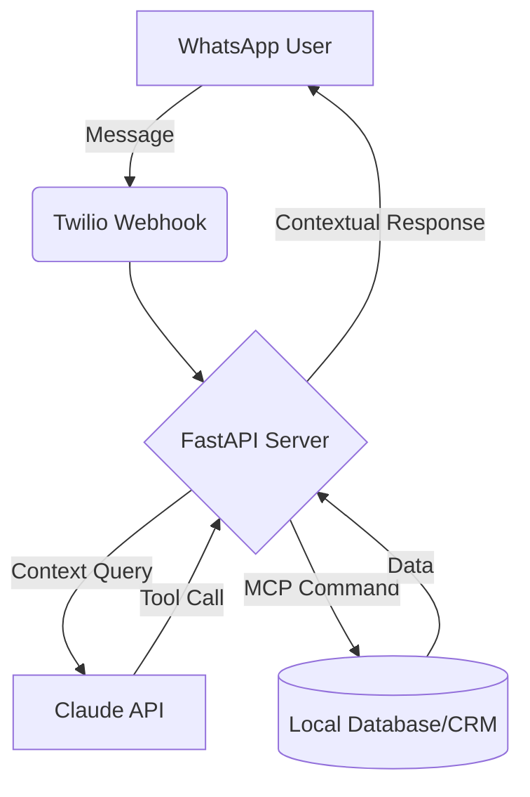

# WhatsApp MCP Business Agent 💬🤖


> An AI-powered WhatsApp business reporting agent leveraging the **Claude API** and the **Model Context Protocol (MCP)** for secure, real-time data ingestion.

## 🌟 Why This Exists
Modern business metrics live across disparate databases, CRMs, and APIs. This agent bridges the gap between siloed data and stakeholders by allowing secure, conversational querying of live financial summaries and analytics directly through WhatsApp. 

## ✨ Key Features
- **Real-Time Financial Summaries**: Interrogates secure databases instantly.
- **MCP Data Access**: Uses the Model Context Protocol to seamlessly and safely connect LLMs to your local APIs without compromising firewall constraints.
- **Twilio Integration**: Enterprise-grade WhatsApp messaging gateway.
- **Active Alerting**: Stateful multi-agent background checking to push critical financial alerts.

## 🏗️ Architecture


## 🚀 Quick Start

1. **Clone the repository:**
   ```bash
   git clone https://github.com/Alan-911/whatsapp-business-agent.git
   cd whatsapp-business-agent
   ```
2. **Install dependencies:**
   ```bash
   pip install -r requirements.txt
   ```
3. **Configure Environment:**
   Create a `.env` file referencing `SETUP.md` with your Anthropic and Twilio API keys.
4. **Run the Server:**
   ```bash
   uvicorn main:app --reload --port 8000
   ```

## 📁 Documentation
Detailed guides can be found in the `/docs` folder:
- [SETUP.md](docs/SETUP.md): Extensive environment and webhook configuration.
- [ARCHITECTURE.md](docs/ARCHITECTURE.md): Deep-dive into the MCP bridging logic.

## 🤝 Contributing
Open to PRs. Please see standard `CONTRIBUTING.md` guidelines. Developed by Yves Alain Iragena.
